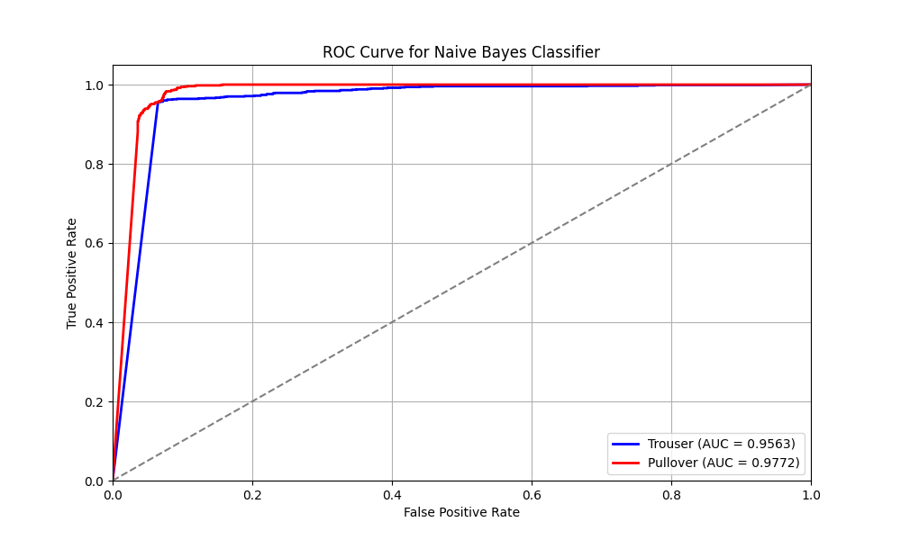
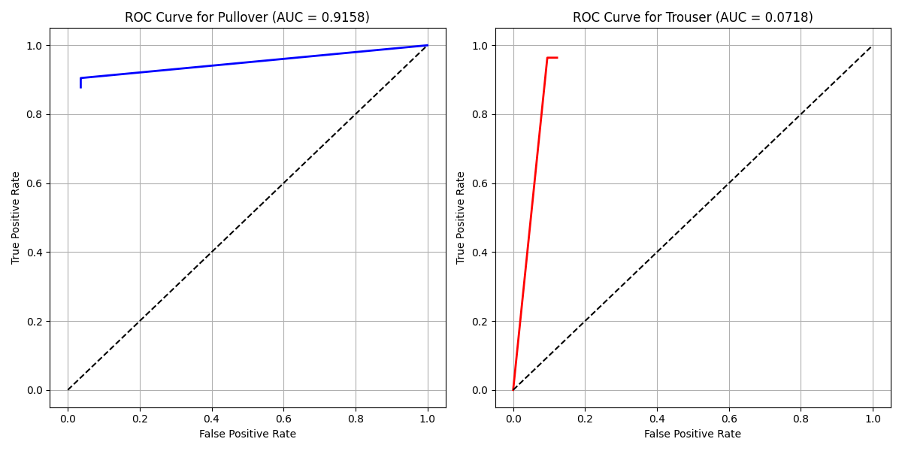

# Fashion-MNIST Binary Classification

## Project Overview

This project implements a machine learning pipeline for image classification using the Fashion-MNIST dataset (specifically trousers vs. pullovers). It explores multiple classification approaches and evaluates their performance using standard metrics. The work is structured as a Jupyter Notebook with supporting Python code.

- Goal: Build and evaluate models that can classify images of clothing items as either trousers or pullovers.
- Data:
  - Training set: Provided as train_images.csv and train_labels.csv
  - Test set: Provided as test_images.csv and test_labels.csv
  - Each image is represented as flattened pixel values (grayscale, 28×28).
  - Labels: Binary classification (0 = Pullover, 1 = Trouser).

## Technologies Used
- Python (NumPy, Pandas, Matplotlib, Scikit-learn)
- Jupyter Notebook for development and visualization

## Key Features
- Data Preprocessing
    - Binarization of images with a threshold of 127.
    - Includes utility functions to display and visualize images.

- Implemented Functions
    - binarize_images: Converts grayscale image data into binary form.
    - display_image: Helper function to visualize individual images from the dataset.
    - calculate_roc_curve: Computes ROC curve points and calculates the area under the curve (AUC) for model evaluation.

- Models & Techniques
    - Naive Bayes Classification: Applies probabilistic classification on the binarized dataset.
    - Decision Tree Classifier: Implements a decision tree with the Gini index as the splitting criterion and a maximum depth of 10 to classify trousers vs. pullovers.

- Evaluation Metrics
    - Accuracy of classifiers on training and test sets.
    - ROC Curve and AUC (Area Under Curve) for comparing model performance.

## Key Findings
- Naive Bayes provided a simple but effective baseline, performing reasonably well on binarized images.
  
- 
- Decision Tree (with Gini index and depth = 10) achieved higher accuracy than Naive Bayes, demonstrating its ability to capture more complex patterns in the data.
- ROC analysis confirmed that the decision tree provided a better trade-off between true positive and false positive rates, with higher AUC values compared to Naive Bayes.
- Visualization of binarized images and classification results provided interpretability into model performance.